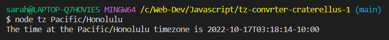
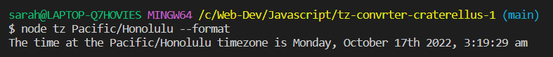

# Time Zone Converter

This app is designed to show the user what the current time is in a specified time zone.

## How to Use
In the terminal, write the following command:

> `$ node tz (time zone)`

Where (time zone) can be replaced with a valid time zone.

The following is an example of the output for the Pacific/Honolulu timezone.

If you include the --format flag in your command, the time will be formatted in a more readable way.

If you put in the following command

> `$ node tz Pacific/Honoluhu --format`

You will get this output:

Which displays the time converted into a week, day, month, year, time format.